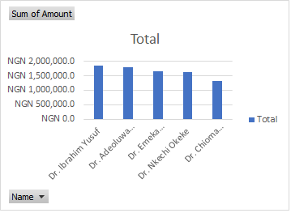
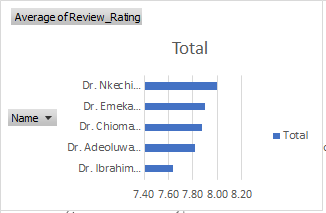
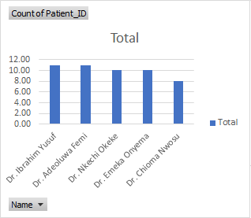
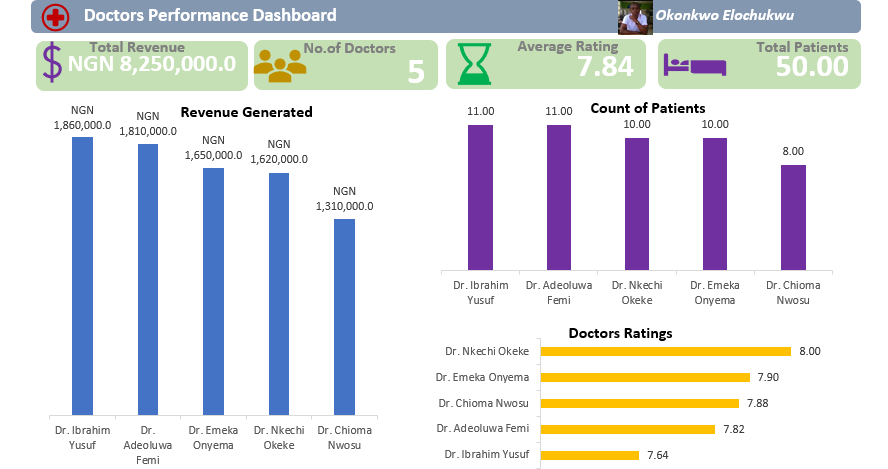

# Doctors-Performance-Dashboard

# INTRODUCTION
The hospital owner seeks to evaluate the performance of each medical doctor employed at their facility. 

# PROBLEM STATEMENT

•	To identify which Doctor generated highest revenue

•	To identify which Doctor has the highest rating

•	To identify how many patients handled by each doctor 

# DATA SOURCE
I  downloaded the Excel worksheet from https://docs.google.com/spreadsheets/d/1TxMk33EvFTeK8aPXqFTjW8SbM3DLLJXv/edit?usp=drivesdk&ouid=101592581358205179688&rtpof=true&sd=true
 and then extracted into my Excel application power query for proper cleaning and transformation. 
Please note that this dataset and report do not represent any real organization; they are simply a demonstration of my proficiency in the use of Microsoft Excel There are five different datasets namely Doctors, Patients, Payments, Ratings and Treatment. The dataset contains two days data 5th – 6th annuary 2014. 

# SKILLS DEMONSTRATED
•	Data extraction

•	Data cleaning

•	Data Transformation

•	Data Modelling

•	Data visualization

•	Data analysis

•	Critical thinking

•	Problem solving.

# DATA CLEANING/ TRANSFORMATION

•	I cleaned the Doctors table by removing null values changing the DoctorID (primary key) data type to text. 

•	I cleaned the Patients table by removing null values changing the PatientID (primary key) data type to text. 

•	I cleaned the Treatment table by removing null values changing the PatientID (primary key) data type to text. 

•	I cleaned the Payment table by removing null values changing the PatientID (primary key) data type to text, Changed Date column data type to Date and changed Amount column data type to Currency

•	I cleaned the Treatment table by removing null values changing the PatientID (primary key) data type to text, Changed Ratings column data type to whole number

•	I checked all columns and ensured there are no spaces

•	Removed Treatment Outcome and Diagnosis columns because they are not part of the objectives.

# DATA MERGING/MODELLING

•	I created a new table and merged DoctorID in both Treatment and Doctors tables respectively. 

•	I merged PatientID in newly created table with Payment table.

•	I merged PatientID in newly created table with Treatment table.

•	I merged PatientID in newly created table with Ratings table.

# DATA ANALYSIS AND VISUALIZATION

I proceeded to analyze the data step by step according to the questions and aim of the project.

## 1. Doctor that generated highest revenue
This analysis was visualized using Bar Chart. And it was discovered that Dr. Ibrahim Yusuf generated the highest revenue.

## 2. Doctor with highest rating
This was visualized using Bar chart. And it was discovered that Dr. Nkechi Okeke has the highest rating.

## 3. Number of patients handled by each Doctor
This was visualized using  bar chart. And it was discovered that Dr. Ibrahim Yusuf  and Dr. Adeoluwa Femi handled highest number of patients.

# OVERALL ANALYSIS AND VISUALIZATIONS

Click [here]( https://bit.ly/3UDUGVR) to explore the dashboard 

# INSIGHTS/FINDINGS
1. Dr. Ibrahim Yusuf: Despite generating the highest revenue, the low rating indicates a potential issue with patient satisfaction or quality of care. It's essential to investigate the reasons behind the low rating and address any underlying issues. This could involve improving communication with patients, enhancing bedside manner, or addressing any quality-of-care concerns.

2. Dr. Nkechi Okeke: Being the highest-rated staff member, she sets a benchmark for patient satisfaction and quality of care. Her practices and approaches could be studied and potentially implemented across the hospital to improve overall patient experience and satisfaction levels.

3. Dr. Adeoluwa: Along with Dr. Ibrahim Yusuf, Dr. Adeoluwa handles the highest number of patients. This could suggest that they are efficient and effective in managing their workload. However, it's important to ensure that the quality of care is not compromised due to the high patient volume. Adequate support systems, efficient scheduling, and proper time management strategies should be in place to maintain both quality and efficiency.

# RECOMMENDATIONS AND CONCLUSIONS:

- Conduct a thorough review of Dr. Ibrahim Yusuf's practices to identify areas for improvement in patient satisfaction.
  
- Implement best practices observed from Dr. Nkechi Okeke to enhance patient satisfaction and quality of care hospital-wide.
  
- Ensure that Dr. Adeoluwa and Dr. Ibrahim Yusuf have adequate support to manage their high patient volume without compromising quality.
  
- Regularly monitor patient feedback and ratings for all doctors to identify trends and address any issues promptly.
  
- Invest in ongoing training and professional development opportunities for all staff to continuously improve patient care delivery.

## Thank you for Reading

